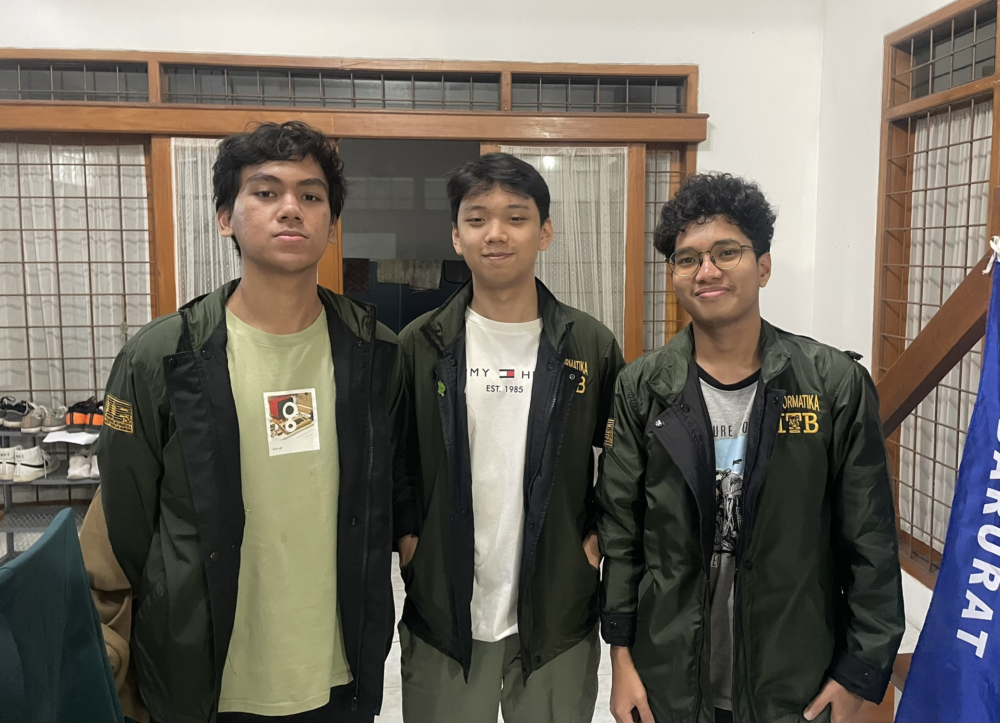

# BARMusic

> Penerapan konsep materi Aljabar Linear dan Geometri dalam bentuk website _information retrieval_

Proyek ini bertujuan untuk mengimplementasikan beberapa konsep materi pada mata kuliah IF2123 Aljabar Linear dan Geometeri, seperti Singular Value Decomposition (SVD), Euclidean Distance, dan Cosine Similarity. Realisasi proyek ini dalam bentuk website yang mampu melakukan _image_ dan _audio retrieval_.

## Kelompok 56 - BARMusic

| NIM | Nama |
| :---: | :---: |
| 13523052 | Adhimas Aryo Bimo |
| 13523068 | Muhammad Rusmin Nurwadin |
| 13523112 | Aria Judhistira |

## Instalasi / Memulai

Untuk memulai proyek ini, silakan clone repository ini dengan menjalankan perintah di bawah ini pada direktori Anda.

```shell
git clone https://github.com/ryonlunar/Algeo02-23052.git
cd Algeo02-23052
``` 

### Konfigurasi Awal

Sebelum menjalankan proyek ini, pastikan Anda telah menginstal Python (maks. versi 3.11), FastAPI, dan Node.js (versi 14 atau lebih tinggi).

### Struktur Program

```bash
├── model/
├── myenv/
├── doc/
├── test/
├── src/
    ├── backend/
        │   database.db
        │   main.py
        │   mapper.txt
        │   requirements.txt
        │
        ├── app/
        │   ├── __pycache__/
        │   ├── album_images/
        │   ├── music_audios/
        │   ├── routes/
        │   │   ├── __pycache__/
        │   │   ├── mic/
        │   │   │   ├── __pycache__/
        │   │   │   ├── recorded_input/
        │   │   │   └── recorded_output/
        │   │   │
        │   │   ├── audiomic_router.py
        │   │   ├── audiomic.py
        │   │   ├── microphone.py
        │   │   ├── wav_midi_converter.py
        │   │   ├── __init__.py
        │   │   ├── audio_routes.py
        │   │   ├── audio.py
        │   │   └── image.py
        │   │
        │   └── temp/
        │       └── __init__.py
    ├── frontend/
        │   .env
        │   .gitignore
        │   eslint.config.js
        │   index.html
        │   package-lock.json
        │   package.json
        │   README.md
        │   tailwind.config.js
        │   tsconfig.app.json
        │   tsconfig.json
        │   tsconfig.node.json
        │   vite.config.ts
        │   vite-env.d.ts
        │
        ├── src/
        │   ├── assets/
        │   ├── components/
        │   │   ├── Navbar.css
        │   │   ├── Navbar.tsx
        │   │   ├── Sidebar.css
        │   │   └── Sidebar.tsx
        │   │
        │   ├── pages/
        │   │   ├── AlbumPage.css
        │   │   ├── AlbumPage.tsx
        │   │   ├── AudioDetail.tsx
        │   │   ├── AudioDetails.css
        │   │   ├── AudioResult.css
        │   │   ├── AudioResult.tsx
        │   │   ├── MusicPage.css
        │   │   ├── MusicPage.tsx
        │   │   ├── RetrievalPage.css
        │   │   └── RetrievalPage.tsx
        │   │
        │   ├── App.css
        │   ├── App.tsx
        │   ├── index.css
        │   └── main.tsx
        │
        ├── node_modules/
        ├── public/
        ├── test/
        └── database.db             
```

## Pengembangan

Sebelum menjalankan program, silakan membuat virtual environment sendiri atau mengikuti rangkaian perintah sebagai berikut di terminal. 
Untuk Python:

```shell
python -m venv venv
.\venv\Scripts\activate
```
Atau jika Anda menggunakan Anaconda/Miniconda, buka Anaconda prompt atau terminal Anda dan silakan mengikuti rangkaian perintah ini:
```shell
conda create --<Nama Environment> myenv python=3.11
conda activate myenv
```
Pastikan bahwa Anda menjalankan rangkaian perintah pada direktori root Algeo02-23052.

### Menjalankan Program

Untuk menjalankan program, Anda dapat mengikuti rangkaian perintah sebagai berikut.

Pastikan sudah berada di folder Algeo02-23052
```shell
cd src/backend
pip install -r requirements.txt
cd app
uvicorn main:app --reload
```

Lalu, untuk menjalankan website-nya sendiri, silakan membuka terminal baru dan mengikuti rangkaian perintah di bawah ini.

```shell
cd src/frontend
npm install
npm run dev
```

Silakan mengikuti tautan yang disediakan oleh sistem untuk menampilkan website menggunakan localhost.

## Fitur

Website ini memiliki beberapa fitur utama.
* **Audio Retrieval by File Upload**: Mencari dan menampilkan file-file audio yang paling mirip dalam dataset dengan file audio yang diunggah. Perhatikan bahwa program **hanya menerima file audio MIDI** dengan ekstensi .mid. Fitur ini dapat dijalankan melalui tombol **Audio** pada sidebar.
* **Audio Retrieval by Microphone**: Mencari dan menampilkan file-file audio yang paling mirip dalam dataset dengan file audio rekaman dengan microphone. Durasi rekaman sejak dari memulai rekaman adalah 20 detik. Fitur ini dapat dijalankan melalui tombol **Microphone** pada sidebar.
* **Image Retrieval**: Mencari dan menampilkan file-file gambar dari dataset yang paling mirip dengan file gambar yang diunggah. Program akan menerima file gambar dengan ekstensi .jpg, .jpeg, dan .png. Fitur ini dapat dijalankan melalui tombol **Pictures** pada sidebar.
* **Upload Folder and Mapper**: Menampilkan file-file pada dataset yang diunggah. Pengunggahan folder gambar dan audio perlu disertai dengan mapper. Program akan menerima file gambar dengan ekstensi .jpg, .jpeg, dan .png, file audio dengan ekstensi .mid, dan folder dengan ekstensi .zip. Fitur ini dapat dijalankan melalui tombol **Upload** pada sidebar.

## Berkontribusi

Jika Anda ingin turut berkontribusi dalam proyek ini, Anda dapat fork repositori ini dan melakukan pengembangan pada branch Anda sendiri. Silakan melakukan pull request supaya kami dapat melihat dan menerima kontribusi Anda.

## Tautan

Berikut adalah beberapa tautan penting untuk Tugas Besar ini:
- Homepage proyek: [Link Github](https://github.com/ryonlunar/Algeo02-23052)
- Laporan Tugas Besar 2: [Laporan](https://docs.google.com/document/d/1I6VSnJfloJqSLwa_ekCG5Ing0vFnCK88DWL2hvpMMdc/edit?usp=sharing)
- Video Dokumentasi Tugas Besar 1 Aljabar Linear Dan Geomerri IF2123: [Video](https://drive.google.com/drive/folders/1bHiSWCJfS6E7iMWKeURPJ4uyfhXMXhiZ?usp=sharing)

## Lisensi

Kode dalam proyek ini dilisensikan di bawah lisensi MIT. Anda dapat melihat teks lisensinya [di sini](LICENSE).
